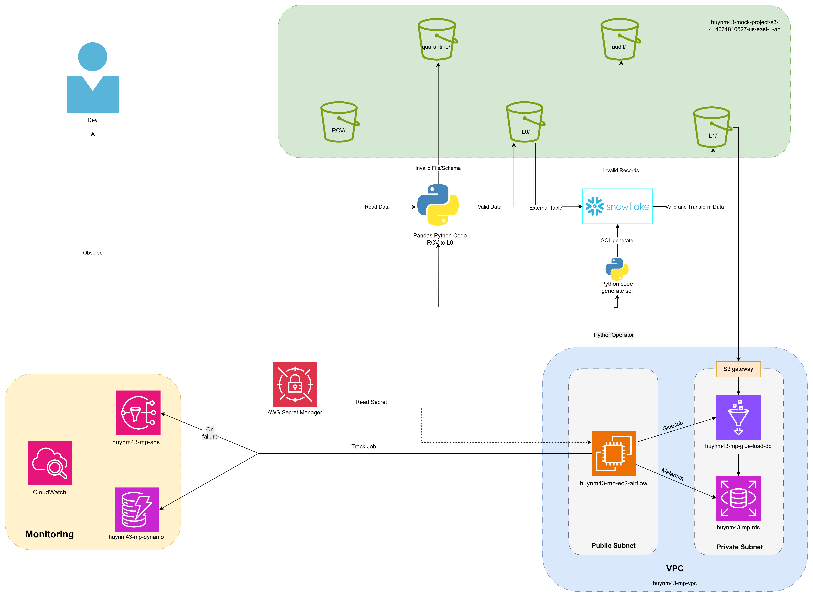

# Architecture
## 1. Overview



### Component Responsibility

| # | Component | Type | Primary Responsibility |
|---|------------|------|------------------------|
| 1 | S3 `ec2-airflow/` and `glue/` | Storage | Stores Apache Airflow DAG source code, and glue source code. |
| 2 | S3 `config/` | Storage | Stores YAML configuration files for each layer (`rcv`, `l0`, `l1`) and table-specific processing rules. |
| 3 | S3 Data Lake (`rcv`, `l0`, `l1`, `quarantine`, `audit`) | Storage | Stores raw files, validated datasets, transformed datasets, invalid files, audit records, and processing artifacts. |
| 4 | EC2 `huynm43-mp-ec2-airflow` | Compute Orchestration | Runs Airflow and triggers PythonOperator and Glue Jobs according to scheduling and dependencies |
| 5 | Airflow `PythonOperator` (RCV -> L0) | Compute | Executes Python scripts validating data. Reads files from the `rcv` layer, validates file structure and schema, moves invalid files to `quarantine`, and writes validated output to `l0`. |
| 6 | Airflow `PythonOperator` (L0 -> L1) | Compute | Executes Python scripts to generate sql text and initialize snowflake warehouse connection to process data from `L0` to `L1` |
| 7 | `Snowflake` (L0 -> L1) | Data Warehouse / Compute | Execute External Tables, validation, and transformations from L0 to L1 |
| 8 | Glue Job `huynm43-mp-glue-load-db` | Compute | Loads L1 datasets into PostgreSQL |
| 9 | Amazon RDS PostgreSQL | Database | Serves as the final curated data store for reporting, analytics, and downstream applications. Supports Full Load, Upsert, and Append-Only ingestion strategies. |
| 10 | S3 Gateway Endpoint | Network | Provides private connectivity between EC2 and Amazon S3 without requiring internet or NAT Gateway access. |
| 11 | VPC (`huynm43-mp-vpc`) | Network | Provides network isolation for platform resources and enforces secure communication paths between components. |
| 12 | CloudWatch | Monitoring | Collects logs, metrics, and operational events from Airflow, EC2, and data processing tasks. Supports troubleshooting and operational monitoring. |
| 13 | SNS `huynm43-mp-sns` | Alerting | Sends notifications when pipeline failures occur. Airflow tasks publish alerts using standardized error messages for easier incident investigation. |
| 14 | DynamoDB `huynm43-mp-dynamo` | Audit & Tracking | Stores job execution metadata, pipeline status, processing history, error tracking information, and supports idempotent reruns. |


## 2. Compute & Orchestration Layer
### AWS EC2 – `huynm43-mp-ec2-airflow` (Deployed in a Public Subnet)
- Serves as the host running **Apache Airflow**, acting as the central **orchestrator** for the entire data pipeline.
- DAG source code is pulled from Amazon S3.
- Each processing stage in the pipeline (RCV→L0 validation, load data from l0 to snowflake, triggering Snowflake processing for L0→L1, and loading L1→RDS) is executed through Airflow **`PythonOperator`** tasks.
- EC2 retrieves credentials (Snowflake account, username, password, warehouse, database, schema, and RDS credentials) from **AWS Secrets Manager** at runtime, avoiding hard-coded secrets in source code.
- The instance is deployed in a **Public Subnet** to expose the Airflow Web UI for administration. External connectivity (S3, Snowflake, etc.) is controlled through Security Groups, NAT, and VPC Endpoints.

## 3. Storage Layer (Amazon S3)
- Bucket: `huynm43-mock-project-s3-414061810527-us-east-1-an`

| Zone (Prefix) | Purpose |
|--------------|----------|
| `rcv/` | Receive Zone where raw source files are initially uploaded |
| `l0/` | Landing/Raw Zone containing files that passed file-level validation and can be queried by Snowflake External Tables |
| `l1/` | Curated Zone containing validated and transformed data ready for loading into downstream databases |
| `quarantine/` | Stores files that failed file-level validation (empty files, unreadable files, schema mismatches, etc.) |
| `audit/` | Stores rejected records at the data level along with detailed validation error reasons |
| `ec2-airflow/` | Stores Airflow DAG source code separately from data assets to support independent lifecycle management and versioning |


## 4. Data Warehouse Layer (Snowflake)
- Snowflake serves as the primary **compute engine** for performing data-level validation and transformation between L0 and L1. It leverages scalable SQL processing on large datasets instead of relying on Python/Pandas execution on EC2.

| Snowflake Object | Name | Purpose |
|-----------------|------|----------|
| Database | `huynm43_mp` | Central database containing all project objects |
| Schema | `retail` | Business schema containing tables and external tables |
| Storage Integration | `huynm43_mp_snowflake_s3` | Secure integration using IAM Role `arn:aws:iam::414061810527:role/huynm43-mp-snowflake-role` that allows Snowflake to read/write directly to the `l0/`, `l1/`, and `audit/` prefixes without exposing access keys |
| File Format | `csv_ff` | CSV format definition with `SKIP_HEADER=1` and quoted fields |
| File Format | `parquet_ff` | Parquet format definition for Parquet-based source tables |
| External Table | `customers`, `products`, `orders`, `province` | Maps files in `l0/{schema}/{table}/` to SQL-queryable tables without physically loading data into Snowflake |
| Permanent Table (`{table}_{run_id}`) | Generated per run | Captures a specific partition (`process_date`) from the external table and enriches it with metadata such as `process_date` |
| Validation Temp Table (`validation_{table}`) | Generated per run | Temporary table containing all source data plus a `validation_errors` array populated by validation rules |
| Transformation Temp Table (`transformation_{table}`) | Generated per run | Temporary table containing only valid records after data type casting and transformation logic has been applied |


## 5. Serving Layer – Amazon RDS PostgreSQL
### `huynm43-mp-rds` (Deployed in a Private Subnet)
- The RDS PostgreSQL instance serves as the final destination for clean business-ready data from the L1 layer and supports downstream applications and BI reporting workloads.
- Deploying RDS in a **Private Subnet** ensures that it is not directly accessible from the Internet. Only resources within the VPC, such as the Airflow EC2 instance, can connect to it.
- Data is loaded into RDS using one of three load strategies, determined by the `load_function` and table configuration:
    - **`append_only`**: Inserts new records without modifying existing data.
    - **`truncate_and_insert`**: Removes all existing data while preserving schema and indexes, then loads a fresh dataset.
    - **`upsert`**: Updates existing records based on primary/business keys and inserts new records when no match exists.

## 6. Security & Credential Management
- **AWS Secrets Manager**: Centrally stores sensitive credentials, including Snowflake and RDS connection details. EC2 retrieves these secrets at runtime, reducing the risk of credential exposure.
- **Snowflake Storage Integration + IAM Role**: Instead of using static AWS access keys, Snowflake securely assumes an IAM Role through the `STORAGE_AWS_ROLE_ARN` configuration. This follows security best practices and limits access through `STORAGE_ALLOWED_LOCATIONS`, restricted to the `l0/`, `l1/`, and `audit/` prefixes.
- **VPC + Private Subnet for RDS**: Prevents direct Internet access to the serving database layer.

### PostgreSQL Password Handling Pattern

A notable security design decision is that Glue Job `huynm43-mp-glue-load-db` does **not** receive the PostgreSQL password directly through Glue Job parameters.

Instead:

1. The job receives only `pg_password_s3_key`.
2. `pg_password_s3_key` acts as a pointer to a secure object stored in Amazon S3.
3. During runtime, the Glue Job retrieves the file and reads the password:

```python
utils.get_object(...)["Body"].read().decode("utf-8").strip()
```

Benefits:

- Prevents database passwords from appearing in Glue Job arguments.
- Reduces exposure in AWS Glue logs and execution history.
- Keeps sensitive credentials out of orchestration layers.
- Supports centralized secret rotation strategies.

## 7. Network Layer (VPC)

| Component | Purpose |
|-----------|---------|
| VPC `huynm43-mp-vpc` | Isolated virtual network containing all project resources |
| Public Subnet | Hosts the Airflow EC2 instance, providing access to the Airflow Web UI and enabling outbound connectivity to Snowflake and AWS services |
| Private Subnet | Hosts the RDS PostgreSQL instance without direct Internet access |
| **S3 Gateway Endpoint** | Provides private AWS-network connectivity between resources in the VPC and Amazon S3, eliminating the need for NAT Gateway traffic, reducing costs, improving security, and lowering latency when accessing `rcv/`, `l0/`, `l1/`, `quarantine/`, and `audit/` zones |


## 8. Monitoring & Alerting

| Component | Purpose |
|------------|----------|
| **CloudWatch** | Collects logs and metrics from EC2 and Airflow to monitor pipeline health and operational status |
| **SNS – `huynm43-mp-sns`** | Sends notifications (email, SMS, webhook, etc.) when Airflow tasks or jobs fail, enabling timely operational response |
| **DynamoDB – `huynm43-mp-dynamo`** | Stores job execution status and history, including run IDs, start/end times, and stage-level execution status to support auditing, retry handling, and idempotency |
