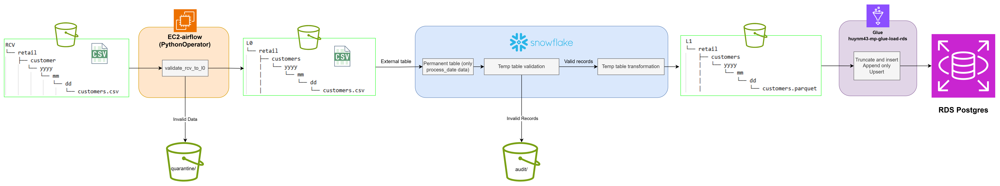

# Data Flow

## 1. Overview



```
RCV -> validate_rcv_to_l0 (validate file, schema) -> L0
L0  -> validate_l0_to_l1 (business validations)  -> transform (business transformations) -> L1
L1  -> load_function (append_only / truncate_and_insert / upsert) -> RDS PostgreSQL
```

## 2. Storage Path Naming Convention

| Zone | Path Structure | Example |
|---|---|---|
| RCV | `rcv/{schema_name}/{table_name}/{yyyy}/{mm}/{dd}/{table_name}.{format}` | `rcv/retail/customers/2026/09/09/customers.csv` |
| L0 | `l0/{schema_name}/{table_name}/{yyyy}/{mm}/{dd}/{table_name}.{format}` | `l0/retail/customers/2026/09/09/customers.csv` |
| Quarantine | `quarantine/{schema_name}/{table_name}/{yyyy}/{mm}/{dd}/{table_name}.{format}` | `quarantine/retail/customers/2026/09/09/customers.csv` |
| L1 | `l1/{schema_name}/{table_name}/{process_date}/{table_name}.{format}` | `l1/retail/customers/2026/09/09/customers.parquet` |
| Audit | `audit/{schema_name}/{table_name}/{process_date}/{table_name}.{format}` | `audit/retail/customers/2026/09/09/customers.parquet` |

- Look for purpose of each layer in [layer purpose](./architecture.md/#3-storage-layer-amazon-s3)

## 3. Stage 1 (RCV to L0)

Executed on **EC2-hosted Airflow (Airflow PythonOperator)**:

1. Load source (`rcv`) and target (`l0`) table configurations.
2. Build storage paths:
   - path_rcv = s3://{bucket}/{rcv_layer}/{schema}/{table}/{process_date}/{table}.{rcv_format}
   - path_l0 = s3://{bucket}/{l0_layer}/{schema}/{table}/{process_date}/{table}.{l0_format}
   - key_quarantine = {quarantine_layer}/{schema}/{table}/{process_date}/{table}.{rcv_format}

3. Execute `validations.validate_rcv_to_l0`:

   - **`validate_file`**
     - Verify file existence.
     - Verify file readability.
     - Verify the file is not empty.
     - Verify the file contains data rows and not only a header.
     - On failure:
       - Copy the original file to `quarantine/`
       - Raise an error.
     - On success:
       - Read data directly into a Spark DataFrame.

   - **`validate_schema`**
     - Compare actual columns against the columns defined in the table configuration.
     - Validate:
       - Column names
       - Column order
     - On mismatch:
       - Copy the file to `quarantine/`
       - Raise `Schema mismatch`.

   - Validation rules can be enabled/disabled through configuration:

   ```json
   {
     "validation": {
       "validate_file": true,
       "validate_schema": true
     }
   }
   ```

4. If the file passes all validations above, the file is copied to L0.

## 4. Stage 2 — Snowflake Initialization & Load L0 Partition

### 1. Initialization Step (One-Time Setup via `init_snowflake.sql` + `init_ext_table.py`)

- `init_snowflake.sql` creates the Database, Schema, Storage Integration, and two File Formats (`csv_ff`, `parquet_ff`).
- `init_ext_table.py`
  - Reads table configurations to obtain table schemas.
  - Generates SQL statements for external table creation.

### 2. **Refresh External Table**

```sql
ALTER EXTERNAL TABLE {schema}.{table} REFRESH '{process_date}';
```

- After the file is successfully validated from RCV to L0, the pre-created Snowflake external table is refreshed for the specified `process_date`.
- Snowflake scans only the corresponding partition path on S3 and updates its file metadata.

### 3. **Create a Run-Scoped Permanent Table**

```sql
CREATE OR REPLACE TABLE {schema}.{table}_{run_id} AS
SELECT *, CAST(CURRENT_TIMESTAMP() AS TIMESTAMP_NTZ) AS process_date
FROM {schema}.{table}
WHERE year = 'yyyy' AND month = 'mm' AND day = 'dd'
```

- After refreshing metadata, create a physical table scoped to the processing date.
- Snapshot data for the target processing date from the External Table into a dedicated physical table named `{table}_{run_id}` (where `run_id` comes from Airflow).
- This design prevents conflicts between concurrent pipeline runs while also adding a `process_date` column for tracking and auditing purposes.

## 5. Stage 3 — L0 -> L1 (Data-Level Validation & Transformation Executed in Snowflake)

### Step 1. Load Source (`l0`) and Target (`l1`) Configurations

### Step 2. Execute `validations.validate_l0_to_l1`

Generate SQL to create a temporary table `validation_{table}`:

```sql
CREATE OR REPLACE TEMP TABLE {schema}.validation_{table} AS
SELECT *,
    ARRAY_CONSTRUCT_COMPACT( ...list of CASE WHEN expressions... ) AS validation_errors
FROM {schema}.{table}_{run_id}
```

The validation framework applies mandatory rules and configuration-driven rules:

| Rule | Always Applied? | Ignore NULL? | Description |
|---|---|---|---|
| `duplicate` (all columns) | Yes | No | Flags fully duplicated records (excluding the first occurrence) |
| `datatype` (per configured column) | Yes | Yes | Validates whether values can be cast to the configured type (integer/decimal/date/timestamp/boolean) |
| `not_null` | Configurable | — | Value must not be NULL or empty |
| `unique` | Configurable | Yes | Value must be unique (for non-primary key columns) |
| `range` | Configurable | Yes | Numeric value must fall within [min, max] |
| `duplicate` (using `primary_key`) | Configurable (if `primary_key` is defined) | — | Detects duplicate business keys |

- Each validation violation generates a string in the format `'rule_name(column_name)'`.
- All violations are collected into the `validation_errors` array.
- A record may violate **multiple validation rules simultaneously**.

### Step 3 — Transform (`transformations.transform_l0_to_l1`)

Generate SQL to create a temporary table `transformation_{table}`, containing **only valid records** (`WHERE ARRAY_SIZE(validation_errors) = 0`):

```sql
CREATE OR REPLACE TEMP TABLE {schema}.transformation_{table} AS
SELECT ...column_expr...
FROM {schema}.validation_{table}
WHERE ARRAY_SIZE(validation_errors) = 0
```

Processing order:

1. **Apply Transformation Rules**
   (Loaded from `config["transformation"]`; multiple rules may be combined.)

   - `split_name`
     - Split into:
       - `first_name` (last token)
       - `last_name` (remaining tokens)
   - `split_address`
     - Split into:
       - `address` (normalized address string)
       - `address_province` (last element after comma)
   - `rename`
     - Rename columns.
   - `filter_columns`
     - Retain only pre-configured output columns.

2. **Cast Data Types**
   - Based on target schema (`config_target["columns"]`).
   - Uses `TRY_CAST` / `TRY_TO_*` to safely handle invalid casts without raising exceptions.
   - `decimal` columns dynamically generate `DECIMAL(precision, scale)`.

3. **System Columns**
   - `process_date` and `source_file` are preserved as-is and are not cast.


### Step 4 — Write Valid Data to L1

```sql
COPY INTO @{l1_stage}/{schema}/{table}/{process_date}/{table}.{l1_format}
FROM (
    SELECT *
    FROM {schema}.transformation_{table}
)
FILE_FORMAT = {schema}.{csv_ff|parquet_ff}
SINGLE = TRUE
OVERWRITE = TRUE
HEADER = TRUE
```

### Step 5 — Write Invalid Data to Audit

```sql
COPY INTO @{audit_stage}/{schema}/{table}/{process_date}/{table}.{audit_format}
FROM (
    SELECT *
    FROM {schema}.validation_{table}
    WHERE ARRAY_SIZE(validation_errors) > 0
)
FILE_FORMAT = {schema}.{csv_ff|parquet_ff}
SINGLE = TRUE
OVERWRITE = TRUE
HEADER = TRUE
```

-> The audit file contains **all invalid records along with the `validation_errors` array**, which lists every validation failure associated with each record for debugging and data quality reporting purposes.

## 6. Stage 4 — L1 -> RDS PostgreSQL (Loading)

Executed by GlueJobOperator with glue `huynm43-mp-glue-load-database.py`:


1. Retrieve the RDS password from the object returned by `GetObject`.
2. Build database connection configuration:

```python
{
    "host": ...,
    "port": ...,
    "database": ...,
    "user": ...,
    "password": ...
}
```

3. Load L1 configuration.
4. Read L1 data.
5. Determine loading strategy:

```python
config["load_database"]["load_strategy"]
```

Supported strategies:

- `append_only`
- `truncate_and_insert`
- `upsert`

6. Create target table if it does not exist:

```sql
CREATE TABLE IF NOT EXISTS ...
```

- The DDL is generated dynamically from table config:

```yaml
columns:
```

7. Execute the selected load strategy.
```
customers     → upsert
products      → upsert
province      → truncate_and_insert
orders        → append_only
```